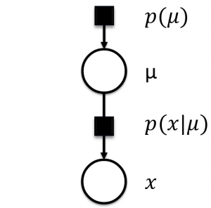

```{r setup, include=FALSE}
knitr::opts_chunk$set(echo = FALSE, cache = TRUE, message = FALSE, warning = FALSE, fig.align = "center")
```

## 3 Tasks to be accomplished

* [Task I](#task1): *Estimation of Integrated and Highly Dimensional Travel Demand Models*  

* [Task II](#task2): *Capturing Latent Travel Patterns with Unknown Number of Activities*  

* [Task III](#task3): *Automating Travel Demand Model Selection and Parameter Tuning* 

# Motivation for Flexible Statistical Modeling  {data-background=#74d1ea}

## Econometrics Vs Machine Learning
* Econometrics:
      + building traditional statistical methods to estimate economic relationships & testing economic theories (Greene, 2011)  
<br> 
     
* Machine Learning:
      + a set of methods that can automatically learn models of data (Murphy, 2013; Ghahramani, 2014)  
<br> 


 #  |   Econometrics                  | Machine Learning
---|    -------------                 |------------------
1. |    Define hypothesis, test it    |  Define generative model, learn parameters 
2. |    Focuses on apriori hypotheses    |  Evaluates results via prediction accuracy
3. |    Emphasize super population inference    |  Emphasize prediction 
4. |    Simpler models preferred             |  Concern for overfitting, not model complexity
5. |    Emphasis on interpretable models | Emphasis on performance 
6. |    Build model once & deploy     |  Model continously improves
7. |    Human improvement               | Automated improvement after deployment
8. |    Standard models e.g Poisson | Also uses Blackbox models e.g neural nets

## Overview of Parametric Regression

* Parametric Modeling
      + Models with a finite set of parameters (e.g. mean, variance) to capture entire complexity in observed data
      
       $$P(\textbf{y}\mid\textbf{x}) = \mathcal{N}(\textbf{y}\mid\mu, \sigma^{2}) $$
      
      $$\mu = \mathbb{E}[\textbf{y}\mid\textbf{x}, \beta] = \beta_0 + \beta\textbf{x} $$
<div>  
```{r fig.height = 4, fig.align = 'center'}
library(plotly)
plot_ly(data = iris, x = ~Sepal.Length, y = ~Petal.Length,
        marker = list(size = 10,
                       color = 'rgba(255, 182, 193, .9)',
                       line = list(color = 'rgba(152, 0, 0, .8)',
                                   width = 2))) %>%
  layout(xaxis = list(title = "independent variable, x"), 
         yaxis = list(title = "response variable, y"))
``` 
</div>

## Challenges of Parametric Regression 

1. How do we pick the form of functions to use as our model?

```{r echo = FALSE, out.width = "80%"}
knitr::include_graphics("images/4plots.png")
```

2. How do we represent the uncertainty in our model due to?
      + Noisy data,
      + Poor model, etc. 

## Parametric Bayesian Modeling (1/2)
* Bayesian Modeling:
      + The process of fitting a probability model to data & summarizing the result using a probability distribution (Gelman, 2014)

```{r echo = FALSE, out.width = "80%"}
knitr::include_graphics("images/bayes-theorem.png")
```

## Parametric Bayesian Modeling (2/2)

* Allows to incorporate domain knowledge & quantify uncertainty 
```{r echo = FALSE, out.width = "30%"}

```
    
```{r echo = FALSE, out.width = "50%"}
knitr::include_graphics("images/bayes-theorem-fig.jpg")
```

## Nonparametric Bayesian Modeling (1/4)

* Recall Bayes theorem for the parametric case:
      + $\theta$ are the unknown parameters we seek to learn e.g $\{\beta, \sigma \}$  
      
$$ P(\theta \mid y,x) = \frac{P(y \mid \theta,x) \, P(\theta)}{P(y\midx)} $$

* In the **Nonparametric case**:
      + Instead, We want to learn the function $f$ that explains the data:
      
      $$y=f(x)+\varepsilon$$
      
      + $f$ is now treated as the unknown parameter we seek to learn  
<br>      
* Now modify the above Bayes theorem to non-parametric:
      + By placing prior over an $\infty$-dimensional space of functions, $p(f)$

$$ P(f\mid y,x) = \frac{P(y \mid f) \, P(f \mid x)}{P(y \mid x)} $$

## Nonparametric Bayesian Modeling (2/4)

* What is this prior distribution over functions, $p(f)$?
      + It's the infinite set of imaginable functions
      + It's called a Gaussian Process (GP) prior  
      
```{r echo = FALSE, out.width = "100%"}
knitr::include_graphics("images/gpsamples.png")
```

## Nonparametric Bayesian Modeling (3/4)

* a GP prior is parameterized by: 
$$f(x) \sim GP(m(x), k(x, x'))$$
      + $m(x)$ = mean function
      + $k(x, x')$ = covariance (kernel) function  
<br>

* Any finite set of function evaluations $f(x_i)_1^N$ have a joint Gaussian distribution (Williams and Rasmussen 2006). 

```{r echo = FALSE, out.width = "100%"}
knitr::include_graphics("images/gp-formula.png")
```

## Nonparametric Bayesian Modeling (4/4)

* The updated Bayes formula for the GP posterior:
$$ P(f\mid y,x) = \frac{P(y \mid f) \, P(f \mid x)}{P(y \mid x)} = \frac{P(y \mid f) \, \mathcal{N}(m(x), K(x))}{P(y \mid x)} $$
<br>

* A fitted GP posterior on the same data looks like:
```{r echo = FALSE, out.width = "70%"}
knitr::include_graphics("images/1plotgp.png")
```
      + Shows both mean & covariance functions
      + Areas without data have high uncertainity & vice versa

## Modeling High Dimensional Problems
* High number of variables increases computational requirements
<div>
```{r echo = FALSE, fig.height = 4, fig.align = 'center'}
library(plotly)
kd <- with(MASS::geyser, MASS::kde2d(duration, waiting, n = 50))
plot_ly(x = kd$x, y = kd$y, z = kd$z) %>% add_surface() 
``` 
</div>

* Proposed solution
      + Decompose the high-dimensional function $f_D$ into a sum of $N$ low-dimensional functions  

$$f_D(x_1, x_2, ..., x_D)=f_1(x_1, x_2) + f_2(x_3) + ... + f_N(x_D)$$

# Example <br/> Parametric Vs Nonparametric  {data-background=#74d1ea}

## Bayesian <span style="color:red">Linear</span> Model (1/4)

* **Objective**: predict ***mpg*** as a function of ***displacement (disp)***.
\begin{aligned}
y &= f(\textbf{x}) + \varepsilon, \\
f(\textbf{x}) &= \beta_0 + \beta\textbf{x}.
\end{aligned}  

      + Assume additive noise  
      + Assume $\varepsilon \stackrel{\text{iid}}{\sim} \mathcal{N}(0, \sigma^2)$   
<br>

```{r echo = FALSE}
library(dplyr)
library(DT)
mtcars$id <- 1:nrow(mtcars)
train <- dplyr::sample_frac(mtcars, 0.5)
test  <- dplyr::anti_join(mtcars, train, by = 'id')
datatable(mtcars, class = 'cell-border stripe', 
          options = list(pageLength = 5))
```

## Bayesian <span style="color:red">Linear</span> Model (2/4)
* **Step 1**: Define priors on the parameters, $\theta$
      + Intercept: $\beta_0 \sim \mathcal{N}(0, 20)$  
      + Slope: $\beta_1 \sim \mathcal{N}(0, 15)$
      + Noise-deviation: $\sigma \sim \mathcal{N}(0, 5)$ 
<div>
```{r fig.height = 5, fig.align='default'}
intercept_df <- data_frame(rnorm(n = 10000, mean = 0, sd = 20)) 
colnames(intercept_df) <- "intercept"
slope_df <- data_frame(rnorm(n = 10000, mean = 0, sd = 15)) 
colnames(slope_df) <- "slope"
noise_df <- data_frame(rnorm(n = 10000, mean = 0, sd = 10)) 
colnames(noise_df) <- "noise"
params_plot <- ggplot() + 
  geom_density(data = intercept_df, aes(x = intercept, fill = "intercept"), alpha = 0.2) + 
  geom_density(data = slope_df, aes(x = slope, fill = "slope"), alpha = 0.2) + 
  geom_density(data = noise_df, aes(x = noise, fill = "noise"), alpha = 0.2) + 
  theme_bw() + theme(legend.position = "bottom") +
  xlab('parameters') + 
  scale_fill_manual(name = '', values = c('intercept'='green',
                                           'slope'= 'blue',
                                           'noise'='red'))
ggplotly(params_plot)
```
</div>

## Bayesian <span style="color:red">Linear</span> Model (3/4)
* **Step 2**: Define the likelihood
$$
\begin{aligned}
P(\textbf{y}\mid\textbf{x}, \mathbf{\theta}) & = \mathcal{N}(\mu, \sigma^{2}) = \mathcal{N}(\beta_0 + \beta\textbf{x}, \sigma^{2})
\end{aligned}
$$

* **Step 3**: Find the posterior of parameters
$$
\begin{aligned}
P(\theta \mid \textbf{y}, \textbf{x}) &\propto P(\theta ) P(\textbf{y} \mid \textbf{x}, \mathbf{\theta})
\end{aligned}
$$    

```{r fig.height = 4}
library("bayesplot")
color_scheme_set("brightblue")
my_fit_lm <-readRDS("my_fit_lm_mtcars.RDS")
names(my_fit_lm)[2] <- "slope"
names(my_fit_lm)[3] <- "noise_variance"
array_of_draws <- as.array(my_fit_lm)
mcmc_dens(array_of_draws, 
          pars = c("intercept", "slope", "noise_variance"), 
          facet_args = list(labeller = ggplot2::label_parsed)) + 
  facet_text(size = 13, color = "darkblue") +
  ggtitle("Posterior distributions of parameters", 
          subtitle = "from Bayesian Linear Regression")
```
      
## Bayesian <span style="color:red">Linear</span> Model (4/4)
* **Step 4**: Validate the model on test data, $\textbf{x}_*$

$$
\begin{aligned}
P(\textbf{y}_* \mid \textbf{x}_*, \textbf{x, y}) = \int P(\theta \mid \textbf{y}, \textbf{x}) P(\textbf{y}_*\mid\textbf{x}_*, \theta) \, d\theta
\end{aligned}
$$  
```{r fig.height=5}
p1 <- ggplot(test, aes(x = test$disp, y = test$mpg)) +
  geom_point(aes(colour = 'Test data'), size = 3) +
  geom_abline(aes(intercept = 28.31, slope = -0.04, colour = 'Posterior linear function')) + 
  theme_bw() + theme(legend.position = "bottom") + 
  xlab("x = displacement") + 
  ylab("y = mpg") + 
  scale_color_manual(name = '', values = c('Test data'='black',
                                           'Posterior linear function'= 'blue')) +
  ggtitle("Bayesian Linear Regression", 
          subtitle = "The estimated parameters are used in the linear model to make predictions using inputs from test data.\n RMSE = 6.611 and MAE = 4.954") +
  scale_x_continuous(breaks = scales::pretty_breaks(n = 20)) + 
  scale_y_continuous(breaks = scales::pretty_breaks(n = 10))
p1
```

## Bayesian <span style="color:green">Nonparametric</span> Model (1/5)
* **Recall**: the Bayesian nonparametric model, Gaussian process prior.  
$$f(x) \sim GP(m(x), k(x, x'))$$
      + $m(x)$ = mean function
      + $k(x, x')$ = covariance function (kernel) 
      
```{r echo = FALSE, out.width = "70%"}
knitr::include_graphics("images/gp-formula.png")
```      
<br>

* The standard kernel is the ***Squared Exponential (SE)*** kernel, $k_y$, below:
$$k_y(x_i, x_j\mid\theta) = \sigma^2_fexp\bigg(-\frac{1}{2l^2}(x_i-x_j)^2\bigg) + \delta_{ij}\sigma^2_n$$
     + $\sigma^2_f$ = signal-variance parameter 
     + $l$ = length-scale parameter ($l$ is positive; controls smoothness) 
     + $\delta_{ij}$ = Kronecker delta function ($\delta_{ij}$ = 1 iff $i = j$ and 0 otherwise)
     + $\sigma^2_n$ = noise-variance parameter

## Bayesian <span style="color:green">Nonparametric</span> Model (2/5)
* **Step 1**: Define a prior, $p(f)$ on the parameter, $f$:
      + signal-variance: $\sigma_f \sim \mathcal{N}(0, 1)$
      + length-scale: $l \sim \mathcal{Gamma}(150, 1)$
      + noise-variance: $\sigma_n \sim \mathcal{N}(1, 0.1)$
      + prior-functions: $\textbf{y} \sim \mathcal{MultiNormal}(0, k_{\sigma^2_f,l}(x_i, x_j)+\sigma^2_n\textit{I}_n)$

```{r fig.height = 4, fig.align='default'}
length_scale_df <- data_frame(rgamma(n = 10000, shape = 150, rate = 1)) 
colnames(length_scale_df) <- "length_scale"
noise_variance_df <- data_frame(rnorm(n = 10000, mean = 1, sd = 0.1)) 
colnames(noise_variance_df) <- "noise_variance"
signal_variance_df <- data_frame(rnorm(n = 10000, mean = 0, sd = 1)) 
colnames(signal_variance_df) <- "signal_variance"
q2 <- ggplot() +
  geom_density(data = length_scale_df, aes(x = length_scale), fill = "pink", alpha = 0.2) +
  theme_bw() 
q3 <- ggplot() +
  geom_density(data = noise_variance_df, aes(x = noise_variance), fill = "red", alpha = 0.2) +
  theme_bw() 
q1 <- ggplot() +
  geom_density(data = signal_variance_df, aes(x = signal_variance), fill = "purple", alpha = 0.2) +
  theme_bw() 

gridExtra::grid.arrange(q1, q2, q3, ncol = 3)
```


## Bayesian <span style="color:green">Nonparametric</span> Model (3/5)
```{r echo = FALSE}
fit_sim_prior <- readRDS("fit_sim_prior.RDS")
list_of_draws_prior <- rstan::extract(fit_sim_prior, permuted=TRUE)
post_mu_fs_prior <- data.frame(x = seq(from = 50, to = 500, len = 2000), y = t(list_of_draws_prior$y), f = t(list_of_draws_prior$f))
datatable(post_mu_fs_prior[, -c(2:5)], class = 'cell-border stripe', 
          options = list(pageLength = 4))
```

<div>
```{r fig.height = 3, fig.width=10, fig.align = 'default'}
p2 <-  ggplot() + 
      theme_bw() +
      #geom_rect(xmin = -Inf, xmax = Inf, ymin = -2.0, ymax = 2.0, fill = "grey80") + 
      geom_line(data = post_mu_fs_prior, aes(x = x, y = f.1, color = "f1 prior function")) +
      geom_line(data = post_mu_fs_prior, aes(x = x, y = f.2, color = "f2 prior function")) +
      geom_line(data = post_mu_fs_prior, aes(x = x, y = f.3, color = "f3 prior function")) +
      geom_line(data = post_mu_fs_prior, aes(x = x, y = f.4, color = "f4 prior function")) +
      # geom_line(data = df_prior, aes(x = x, y = f_mean, color = "f function values")) +
      # geom_point(data = (data = dplyr::filter(post_mu_fs_melt, variable == "y.1"))[set,], 
      #            aes(x = x, y = value, colour = 'Sample observed data')) + 
      theme_bw() + theme(legend.position="bottom") + 
      scale_color_manual(name = '', values = c('Sample observed data'='black',
                                               'f1 prior function'='red',
                                               'f2 prior function'='blue',
                                               'f3 prior function'='green',
                                               'f4 prior function'='purple')) +
      xlab("x = displacement") + ylab("y = mpg") + 
      ggtitle("Four Samples from the Gaussian Process prior", 
              subtitle = "length-scale = 200, alpha = 1, sigma = 0.32")
ggplotly(p2)
```
</div>

## Bayesian <span style="color:green">Nonparametric</span> Model (4/5)
* **Step 2**: Define the likelihood
$$
\begin{aligned}
P(y \mid f, \sigma_n) = \mathcal{N}(y \mid f, \sigma^{2}_n) 
\end{aligned}
$$

* **Step 3**: Find the posterior of the function:
$$ 
\begin{aligned}
P(f\mid y,x) & \propto P(y \mid f, \sigma_n) \, P(f \mid x) \\
& \propto \mathcal{N}(y \mid f, \sigma^{2}_n) \, \mathcal{N}(m(x), k_y(x_i, x_j\mid\theta))
\end{aligned}
$$
<br>
```{r fig.height = 4}
library("bayesplot")
color_scheme_set("red")
fit_gp_current <- readRDS("fit_gp_current.RDS")
names(fit_gp_current)[1] <- "length_scale"
names(fit_gp_current)[2] <- "signal_variance"
names(fit_gp_current)[3] <- "noise_variance"
array_of_draws2 <- as.array(fit_gp_current)
mcmc_dens(array_of_draws2, 
          pars = c("length_scale", "signal_variance", "noise_variance"), 
          facet_args = list(labeller = label_parsed)) + 
          facet_text(size = 13, color = "darkblue") +
  ggtitle("Posterior distribution of Hyperparameters", 
          subtitle = "from Bayesian Nonparametric Regression") 
```

## Bayesian <span style="color:green">Nonparametric</span> Model (5/5)
* **Step 4**: Validate the model on test data
$$ 
P(\textbf{y}_*\mid\textbf{x}_*, \textbf{x, y}) = \int P(\textbf{f} \mid y,x) \, P(\textbf{y}_*\mid\textbf{x}_*, \textbf{f}) \, d\textbf{f}
$$

```{r out.width = "80%"}

```

# Appendix {data-background=#74d1ea}

## References

1. D. Emaasit, A. Paz and J. Salzwedel (2016).“A  Model-Based  Machine  Learning  Approach  for Capturing  Activity-Based  Mobility  Patterns  using  Cellular  Data”.

2. McKinsey & Company, (2013). http://bit.ly/2cJ1htj 

3. A. Campbell (2016). "Using Big Data to Measure Small Populations". Presented at the 2016 Conference on Innovations in Travel Modeling. Denver, Colorado, May 1st - 4th. 

4. Bishop, C. M. (2013). [Model-Based Machine Learning](http://rsta.royalsocietypublishing.org/content/371/1984/20120222). Philosophical Transactions of the Royal Society A, 371, pp 1–17

5. Winn, J., Bishop, C. M., Diethe, T. (2015). [Model-Based Machine Learning](http://www.mbmlbook.com). Microsoft Research Cambridge. http://www.mbmlbook.com.
