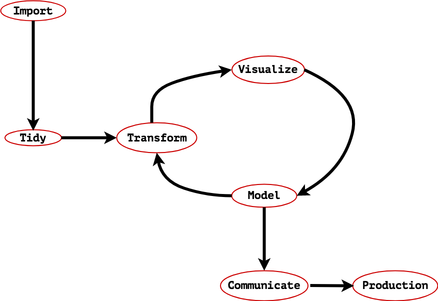

Data Science Meetups & Conferences
====================

* Click this icon  to open the notebooks in a web browser without installing any software.

<figcaption>Haystax's Data Science Workflow.</figcaption>

What's the purpose of this project?
-----------------------------------

This repository provides the Jupyter Notebooks presented at several meetups and conferences including:   
* Bayesian Data Science DC
* Las Vegas R & Data Science Meetup

Getting help
------------

Incase you need help running these Jupyter Notebooks or have general questions, don't hesitate to reach out to me at <demaasit@haystax.com> or <daniel.emaasit@gmail.com>.
